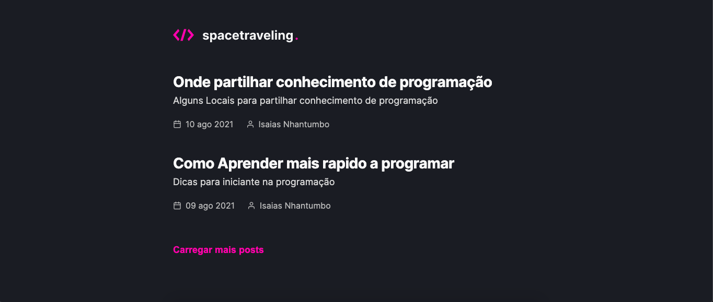
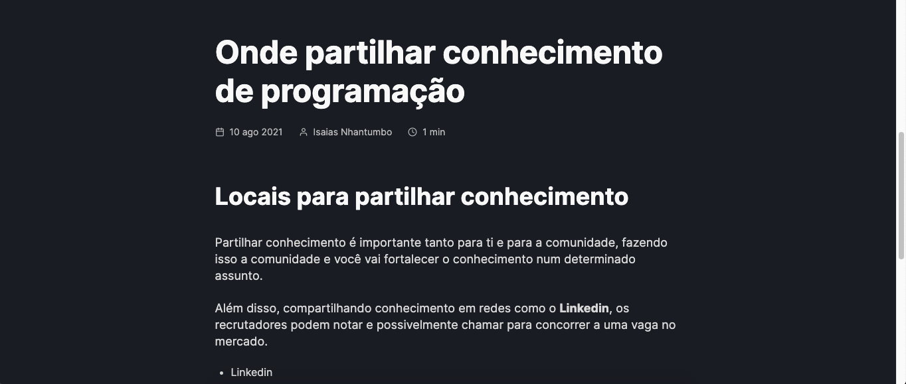
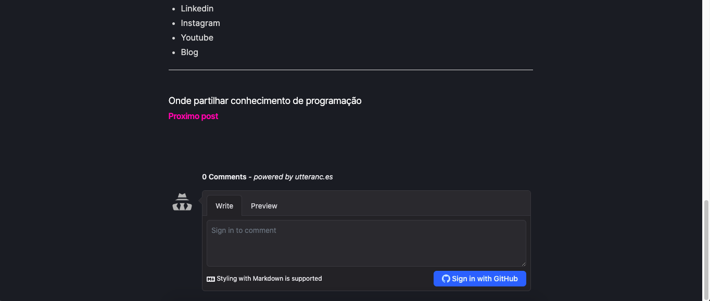

<br/>
<h1 align="center">
  
</h1>
<h2 align="center"> 


</h2>
<br>
<p align="center">
<a href="#-tecnologias-usadas">Tecnologias usadas</a>&nbsp;&nbsp;&nbsp;|&nbsp;&nbsp;&nbsp;
<a href="#-desafios-do-projecto">Desafios do projecto</a>&nbsp;&nbsp;&nbsp;|&nbsp;&nbsp;&nbsp;
<a href="#-pré-requisitos">Pré-requisitos</a>&nbsp;&nbsp;&nbsp;|&nbsp;&nbsp;&nbsp;
<a href="#-como-rodar-o-projecto">Como rodar o projecto</a>
</p>
<p align="center">
     
    
</p>

<p align="center">
O <span>Spacetraveling</span> é blog que foi construindo do zero no desafio do Bootcamp Ignite da Rockeseat na trilha Reactjs.
</p>

<p align="center">
 
 
</p>


---
## 🛠 Tecnologias usadas

As seguintes ferramentas foram usadas na construção do projeto:


- Nextjs
- ReactJs
- Typescript
- Sass
- Date-fns
- React-icons
- Axios
- Prismic


---

## ⛈  Desafios do projecto
  - [x] Construir o interface a partir do layout do Figma
  - [x] Consumir a api do Prismic para carregar os posts
  - [x] Usar a Geração estática do nextjs (Static Generation)
  - [x] Usar o Incremental Static Regeneration do nextjs (ISR) para gerar novos posts.
  - [x] Adicionar uma mensagem de loading caso o post nao tenha sido gerado estaticamente
  - [x] Usuário pode comentar o post (desafio opcional)

---

## ⚠ Pré-requisitos

Antes de começar, você vai precisar ter instalado em sua máquina as seguintes ferramentas:
[Git](https://git-scm.com), [Node.js](https://nodejs.org/en/). 
Além disto é bom ter um editor para trabalhar com o código como [VSCode](https://code.visualstudio.com/)

---
## 🎲 Como rodar o projecto

```bash
# Clone este repositório
$ git clone <https://github.com/isaiasnhantumbo/desafio-ignite-reactjs-criando-um-projeto-do-zero.git>

# Acesse a pasta do projeto no terminal/cmd
$ cd desafio-ignite-reactjs-criando-um-projeto-do-zero

# Abra a pasta no Visual Studio Code
$ code .

# Instale as dependência
$ yarn

# Execute o servidor aplicação com o yarn
$ yarn server

# Execute a aplicação com o yarn
$ yarn dev

# O servidor inciará na porta:3000 - acesse <http://localhost:3000>
```

---


## 📘 Licença
Este projecto usa a  [MIT License](LICENSE).
****
<h1 align="center">
👨🏽‍🏫 
<br>
Desenvolvido por
<br>
 Isaias Nhantumbo Junior
</h1>
</p>
<h1 align="center"> 🤝 &nbsp;Vamos nos conectar ?👨 </h1>

<p align="center">
<a href="https://www.youtube.com/channel/UCOyeYkH0MwJ6RrXTcEFFdAQ?view_as=subscriber"></a>
<a href="https://www.linkedin.com/in/isaias-nhantumbo-junior-733bb619b/"></a>
<a href="https://www.instagram.com/isaias_nhantumbo/"></a>
</p>


